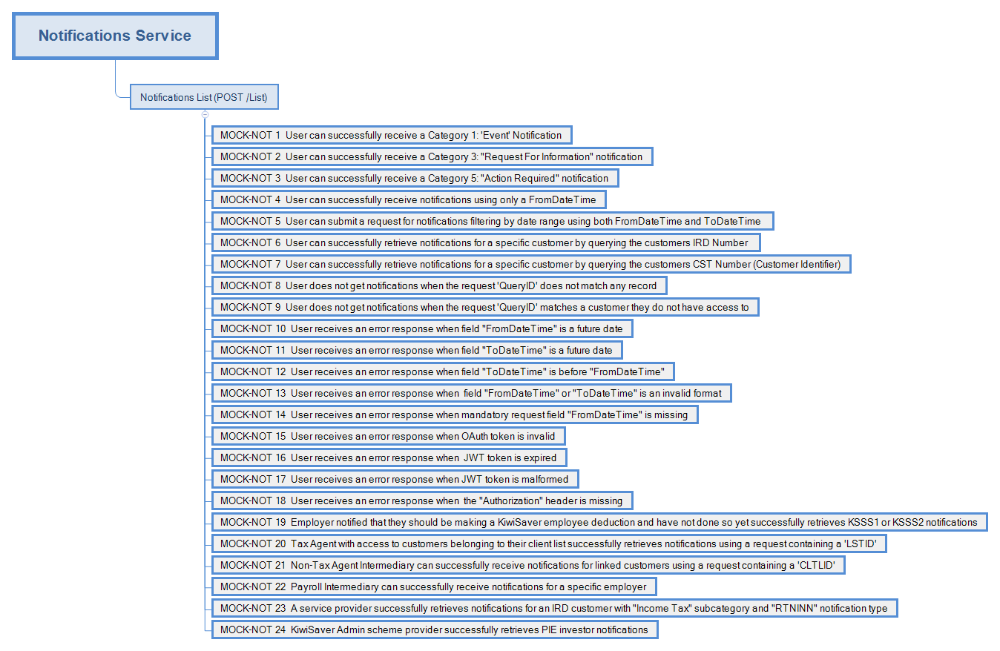

# Notifications Service 

## About the service

The Notifications service delivers read-only notifications to software platforms, with the necessary metadata to describe an underlying event. The receiver of the notification will decide if further information and/or action is needed to respond to the notification.

There are 5 general categories of notification:
* Events - notification about significant events that have occurred.
* Reminders - reminder of future events.
* Request for information - requests from us for information, typically the uploading of a document of a specific type.
* Errors - something that is not correct.
* Action required - something that needs to be done.

The [Document service](../Service%20-%20Document/) can be used to retrieve, submit or update documents associated to a notification.  


## Key documentation

- YAML file
	- View and download the [Notifications API YAML](Notifications%2020230331.yaml)

- Build pack
	- [Download the Notifications build pack](Build%20pack%20-%20Notifications%20v1.pdf)

- Message samples
	- [View message samples for requests and responses](#message-samples)

>**NOTE:** The included [Notifications 2020-10-27.yaml](Notifications%2020230331.yaml) file can be used along with an OpenAPI editor such as [editor.swagger.io](https://editor.swagger.io) to view technical specifications for this operation and generate example client code. 


## Environment information

* [Mock environment information - emulated services, mindmap and test data](#mock-environment-information)

* [Production environment information - URL endpoint](#prod-environment-information)


## Services using this service

* [Employment Service](https://github.com/InlandRevenue/Gateway_Services-Returns-and-Information/tree/master/Service%20-%20Payday%20Filing/Employee%20Details)
* [Income Tax Return Service](https://github.com/InlandRevenue/Gateway_Services-Returns-and-Information/blob/master/Service%20-%20Income%20Tax/IncomeTax.md)  

## Supporting services

* Service: [Identity and access](https://github.com/InlandRevenue/Gateway_Services-Access/tree/master/Identity%20and%20Access) - view how to integrate, OAuth requests and responses message samples and build pack
* Service: [Document](../Service%20-%20Document/)

---
<a name="message-samples"></a>
## Message samples

* Sample JSON payload messages
	* POST /List - Notification Service List
		* [Request body with all fields](Sample%20Files/Sample_POST_List_RequestBody.json)
		* [Request body with mandatory fields](Sample%20Files/Sample_POST_List_RequestBody_Mandatory.json)
		* [Request body KSSchemeProvider](Sample%20Files/Sample_POST_List_RequestBody_KSSchemeProvider.json)
		* [200 Response body](Sample%20Files/Sample_POST_List_ResponseBody.json)
		* [200 Response body with PIR](Sample%20Files/Sample_POST_List_ResponseBody_withPIR.json)
		* [200 Response body withSubmission Key](Sample%20Files/Sample_POST_List_ResponseBody_withSubmissionKey.json)
		* [400 Response body](Sample%20Files/Sample_Error_ResponseBody.json)
		

<a name="mock-environment-information"></a>
## Mock environment information

### Mock emulated service URL
Description | URL
---|---
 Landing Page |  https://notification.test.services.ird.govt.nz
 Service Endpoint |  https://notification.test.services.ird.govt.nz/gateway/notification/list 

### Mock environment authentication
   * Consumers of this mock service must be authenticated.
   * Authentication is provided using one of two methods:
     1. OAuth
        * OAuth token issued by the mock OAuth service. Any valid token issued by the mock OAuth service can be used to access this service.
        * Please consult the [mock OAuth service documentation](https://oauth.test.services.ird.govt.nz/) for further details about the authentication process.
        * The OAuth token should be provided in the 'Authorization' request header as follows:
        ```
        Authorization: Bearer {OAuthAccessToken}
        ```
     2. JWT
        * Alternatively a self-issued JWT may be used to access the service.
        * Please consult the [Notification service build pack](Build%20pack%20-%20Notifications%20v1.pdf) for information on the token structure.
        * The mock service does not validate the following JWT attributes:
            * "sub" field
            * "iss" field
            * token signature
        * The JWT should be provided in the 'Authorization' request header as follows (note the 'Bearer' prefix is omitted):
        ```
        Authorization: {JWT}
        ```

### Notifications mock scenarios mind map

- [View larger image](images/Notifications_Mock_Mindmap.png)


### Test data

* This table shows which scenarios (as per their numbers in the mindmap) require specific data to trigger the expected responses.
* Text in italics represents the name of the JSON node in the request.

| Scenario ID    | Data                                            | Http status | Response                                       |
|----------------|-------------------------------------------------|-------------|------------------------------------------------|
| [MOCK-NOT-001] | QueryIDType": "IRD", <br/> QueryID": "139026551", <br/> FromDateTime": "2018-05-10T01:02:06" or earlier <br/> ToDateTime: "2019-10-01T14:25:31" or later                          | 200         | List with some Notifications                   |
| [MOCK-NOT-002] | QueryIDType": "IRD", <br/> QueryID": "139026659", <br/> FromDateTime": "2018-05-10T01:02:06" or earlier <br/> ToDateTime: "2019-10-01T14:25:31" or later                           | 200         | List with some Notifications                   |
| [MOCK-NOT-003] | QueryIDType": "IRD", <br/> QueryID": "139026551", <br/> FromDateTime": "2018-05-10T01:02:06" or earlier <br/> ToDateTime: "2019-10-01T14:25:31" or later                         | 200         | List with some Notifications                   |
| [MOCK-NOT-004] | FromDateTime": "2018-05-10T01:02:06" or earlier | 200         | List with some Notifications                   |
| [MOCK-NOT-007] | QueryIDType": "CST", <br/> QueryID": "1512290100", <br/> FromDateTime": "2018-05-10T01:02:06" or earlier <br/> ToDateTime: "2019-10-01T14:25:31" or later                             | 200         | List with some Notifications                   |
| [MOCK-NOT-008] | QueryID: "111111111"                            | 200         | Empty list of Notifications                    |
| [MOCK-NOT-009] | QueryID: "123345185"                            | 200         | Empty list of Notifications                    |
| [MOCK-NOT-010] | FromDateTime": "2022-05-10T01:02:06" or later   | 400         | KS0133 Error                                   |
| [MOCK-NOT-011] | ToDateTime: "2022-10-01T14:25:31" or later      | 400         | KS0133 Error                                   |
| [MOCK-NOT-012] | FromDateTime": "2019-05-10T01:02:06", <br/> ToDateTime: "2018-10-01T14:25:31"           | 400         | EV2302 Error                                   |
| [MOCK-NOT-013] | FromDateTime": "2019-02-2501:02:00"             | 400         | EV1100 Error                                   |
| [MOCK-NOT-019] | QueryIDType": "IRD",  <br/> QueryID": "139026551", <br/>  FromDateTime": "2018-05-10T01:02:06" <br/>                          | 200         | List containing Employer related Notifications |
| [MOCK-NOT-020] | QueryIDType": "LSTID", <br/> QueryID": "139023668", <br/> FromDateTime": "2018-05-10T01:02:06"                          | 200         | List with some Notifications                   |
| [MOCK-NOT-021] | QueryIDType": "CLTLID", <br/> QueryID": "1080017", <br/> FromDateTime": "2018-05-10T01:02:06"                         | 200         | List with some Notifications                   |
| [MOCK-NOT-022] | QueryIDType": "IRD" <br/> QueryID": "139026551",<br/>FromDateTime": "2018-05-10T01:02:06"                           | 200         | List containing Employer related Notifications |
| [MOCK-NOT-023] | QueryIDType": "IRD" <br/> QueryID": "139442164",<br/>FromDateTime": "2018-05-10T01:02:06"                             | 200         | List containing IncomeTax and SubmissionKey Notifications |
| [MOCK-NOT-024] | QueryIDType": "KSF" <br/> QueryID": "KSS/11111",<br/>FromDateTime": "2018-05-10T01:02:06"                             | 200         | List containing PIR related Notifications  |

- [Download Test Scenarios report template](Notifications%20Service%20-%20Test%20Scenarios%20Report%20Template.docx)

---
<a name="prod-environment-information"></a>
## Prod environment information

#### Production URL - `https://services.ird.govt.nz:4046/gateway/notification/{Service}`
| Service | HTTP request types | Description | 
| :--: | :--: | -- |
| list | `POST` | This web service is used to retrieve notifications for a given customer | 
| status | `GET` | Response 200 HTTP response with a message body of `OK`. This is used to validate the service and credential configuration. |